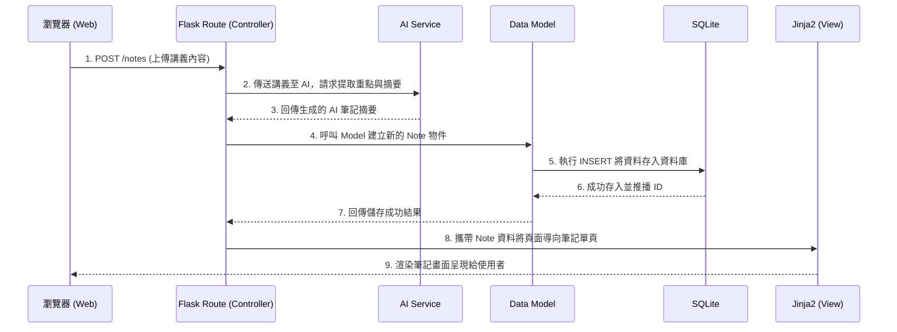

# 系統架構設計 (Architecture)

## 1. 技術架構說明

本專案「AI 學習助理平台」採用單體式架構 (Monolithic Architecture) 搭配 MVC (Model-View-Controller) 設計模式，以降低初期開發難度並能快速驗證產品核心的 AI 概念。

- **選用技術與原因**：
  - **後端框架：Flask (Python)**。輕量級、具高靈活性，且 Python 生態系對於後續呼叫 AI 與自然語言處理相關套件（或 API）整合非常友善。
  - **模板引擎：Jinja2**。不採用前後端分離，直接由後端渲染 HTML 視圖。無需額外建立與維護獨立的前端專案與 API 介面，大幅簡化 MVP 階段的開發流程。
  - **資料庫：SQLite**。無須額外設定資料庫伺服器，以單一檔案運作，非常適合初期系統開發與原型測試。

- **Flask MVC 模式說明**：
  - **Model (資料模型)**：負責定義資料結構（如：User 帳號、Note 筆記、Quiz 測驗）並執行資料的增刪改查，透過 SQLite 進行持久化寫入（建議搭配 SQLAlchemy ORM 管理關聯式資料）。
  - **View (視圖)**：負責最終呈現給使用者的介面。Jinja2 引擎會接收 Controller 傳遞下來的變數，並動態把資料渲染至 HTML 標籤中。
  - **Controller (控制器 / 路由)**：定義使用者的網址路徑 (Routes)。作為橋樑，接收從瀏覽器傳來的 HTTP 請求（例如上傳講義），在其中呼叫 AI 模組或是 Model，處理商業邏輯後把結果拋回給 View。

## 2. 專案資料夾結構

為保持專案整潔度，以下是我們應用程式的資料夾結構與元件職責配置：

```text
app/
├── core/                  ← (選用) 放置共用的第三方服務或工具組合
│   └── ai_service.py      ← 呼叫 LLM 產生摘要與測驗的核心邏輯
├── models/                ← Model：資料庫模型定義與操作
│   ├── __init__.py
│   ├── auth.py            ← 帳號與權限相關
│   └── learning.py        ← 筆記、測驗題庫、錯題本相關模型
├── routes/                ← Controller：Flask 路由與商業邏輯
│   ├── __init__.py
│   ├── auth_routes.py     ← 登入、註冊的 Endpoints
│   ├── note_routes.py     ← 處理講義上傳、呼叫 AI 生成筆記的邏輯
│   └── quiz_routes.py     ← 產出測驗、計算分數與弱點分析的邏輯
├── static/                ← 靜態資源：存放不須加工的靜態檔案
│   ├── css/
│   │   └── style.css      ← 全域或元件樣式
│   └── js/
│       └── main.js        ← 前端輔助互動腳本 (例如顯示 Loading 狀態)
└── templates/             ← View：Jinja2 HTML 模板
    ├── base.html          ← 共用底版 (包含導覽列、頁尾、Head)
    ├── auth/              ← 登入與註冊頁面
    ├── notes/             ← 筆記清單與單一筆記詳細頁面
    └── quiz/              ← 測驗進行頁面與測驗結果頁面
instance/
└── database.db            ← SQLite 本地資料庫檔案 (依安全規範不加入版控)
docs/
├── PRD.md                 ← 產品需求文件
└── ARCHITECTURE.md        ← 系統架構設計文件 (本文件)
app.py                     ← 應用程式進入點，初始化 Flask 與 Blueprint
requirements.txt           ← Python 套件相依清單
```

## 3. 元件關係圖

以下使用序列圖說明當使用者完成「上傳講義並生成筆記」的動作時，系統內部如何運作：



## 4. 關鍵設計決策

1. **選用 SSR（伺服器端渲染）捨棄前端框架（React / Vue 等）**
   - **原因**：為了配合 MVP 將資源著重於核心「AI 運算與學習邏輯」，在此階段完全使用 Server Side Rendering 搭配 Jinja2 可以大幅減少串接 API 及維持兩個獨立專案的心智負擔。
2. **採用 Blueprint 模組化路由**
   - **原因**：儘管初期功能不多，但預先把登入 (`auth_routes`)、筆記 (`note_routes`)、測驗 (`quiz_routes`) 透過 Flask Blueprints 獨立，除了使多人合作時避免改壞 `app.py` 外，系統後續新增功能（例如：社群交流路由）也能輕易橫向擴展。
3. **從 Controller 抽離 `core/ai_service.py` 邏輯**
   - **原因**：與外部 AI（OpenAI 或 Gemini 等）互動的邏輯通常包含繁瑣的錯誤處理（重試、超時）、API 金鑰讀取及 Prompt 組裝。將其從 Controller 隔離出來可以確保路由程式碼乾淨，未來也能輕鬆抽換 AI 供應商。
4. **將生成的筆記與測驗資料落地儲存 (SQLite)**
   - **原因**：如果每次查看都呼叫 AI 再次生成會浪費大量的 API 額度與等待時間。落地儲存不仅解決載入速度及 API 成本問題，更是「進度追蹤」和「弱點分析」報表的資料來源基石。
