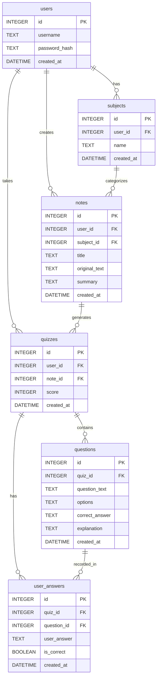

# 資料庫設計 (DB Design)

本文件定義「AI 學習助理平台」的資料庫實體關係與各資料表結構。我們採用 **SQLite** 作為資料庫，並使用 Python 內建的 `sqlite3` 進行操作。

## 1. ER 圖（實體關係圖）

## 2. 資料表詳細說明

### `users` (使用者帳號)
儲存使用者的登入資訊。
- `id` (INTEGER): Primary Key，自動遞增。
- `username` (TEXT): 登入帳號名稱，必填且唯一。
- `password_hash` (TEXT): 密碼的 Hash 值，必填。
- `created_at` (DATETIME): 帳號建立時間，預設為 `CURRENT_TIMESTAMP`。

### `subjects` (科目分類)
讓使用者可以將筆記分類到不同的科目。
- `id` (INTEGER): Primary Key，自動遞增。
- `user_id` (INTEGER): Foreign Key，關聯至 `users(id)`，必填。
- `name` (TEXT): 科目名稱，必填。
- `created_at` (DATETIME): 建立時間。

### `notes` (筆記與摘要)
儲存使用者上傳的原文與 AI 產生的摘要。
- `id` (INTEGER): Primary Key，自動遞增。
- `user_id` (INTEGER): Foreign Key，關聯至 `users(id)`，必填。
- `subject_id` (INTEGER): Foreign Key，關聯至 `subjects(id)`，可為空。
- `title` (TEXT): 筆記標題。
- `original_text` (TEXT): 使用者上傳的原始講義內容，必填。
- `summary` (TEXT): AI 生成的 Markdown 摘要，必填。
- `created_at` (DATETIME): 建立時間。

### `quizzes` (測驗紀錄)
儲存針對特定筆記生成的測驗及其總分。
- `id` (INTEGER): Primary Key，自動遞增。
- `user_id` (INTEGER): Foreign Key，關聯至 `users(id)`，必填。
- `note_id` (INTEGER): Foreign Key，關聯至 `notes(id)`，必填。
- `score` (INTEGER): 使用者在該次測驗獲得的分數。
- `created_at` (DATETIME): 建立時間。

### `questions` (測驗題目)
儲存 AI 產生的測驗題庫。
- `id` (INTEGER): Primary Key，自動遞增。
- `quiz_id` (INTEGER): Foreign Key，關聯至 `quizzes(id)`，必填。
- `question_text` (TEXT): 題目敘述，必填。
- `options` (TEXT): 選項 (JSON 陣列字串儲存)，必填。
- `correct_answer` (TEXT): 正確答案 (對應選項字串)，必填。
- `explanation` (TEXT): 詳解或弱點提示說明。
- `created_at` (DATETIME): 建立時間。

### `user_answers` (使用者作答紀錄)
記錄使用者在每一題選擇的答案與是否正確，用於弱點分析與錯題本。
- `id` (INTEGER): Primary Key，自動遞增。
- `quiz_id` (INTEGER): Foreign Key，關聯至 `quizzes(id)`，必填。
- `question_id` (INTEGER): Foreign Key，關聯至 `questions(id)`，必填。
- `user_answer` (TEXT): 使用者選擇的選項，必填。
- `is_correct` (BOOLEAN): 答案是否正確，必填 (1 或 0)。
- `created_at` (DATETIME): 建立時間。
