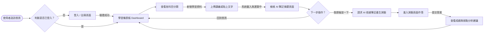
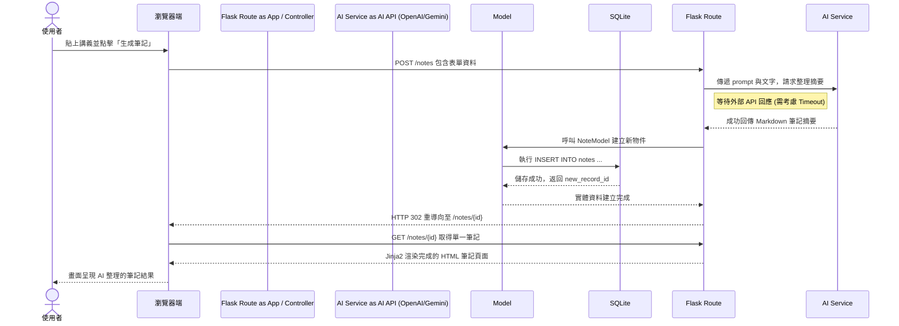

# 流程圖設計 (Flowchart)

本文件根據 [PRD.md](./PRD.md) 與 [ARCHITECTURE.md](./ARCHITECTURE.md) 的設計，詳細說明「AI 學習助理平台」的使用者操作路徑（User Flow）、系統資料序列流動（System Flow），並條列出預計使用的 URL 路由對照表。

## 1. 使用者流程圖（User Flow）

此流程圖描述使用者從註冊進入系統到完成筆記與測驗的心智歷程（Happy Path）：

## 2. 系統序列圖（Sequence Diagram）

以下序列圖展示了平台最核心的功能：**「使用者上傳講義，經過 AI 整理後存入資料庫並返回結果」** 的底層運作。

## 3. 功能清單與路由對照表

根據上述的流程，以下對初步預期的端點 (Endpoints) 進行盤點：

| 功能名稱 | URL 路徑 | HTTP 方法 | 說明與預期行為 |
| :--- | :--- | :---: | :--- |
| 首頁/學習儀表板 | `/` | GET | 顯示登入使用者的學習總覽與近期筆記。 |
| 會員登入 | `/auth/login` | GET / POST | 顯示表單 / 驗證帳號密碼並建立 session。 |
| 會員註冊 | `/auth/register` | GET / POST | 顯示表單 / 新增使用者到資料庫。 |
| 會員登出 | `/auth/logout` | GET | 清除 session，導向首頁。 |
| 新增講義 | `/notes/new` | GET | 提供上傳檔案或貼上講義字串的表單。 |
| 生成AI筆記 | `/notes` | POST | 接收資料、呼叫 AI，成功後轉向該筆記明細。 |
| 檢視單一筆記明細 | `/notes/<int:note_id>` | GET | 使用 Jinja2 渲染展示特定筆記與摘要。 |
| 從筆記生成測驗 | `/quiz/generate/<int:note_id>`| POST | 將筆記字串發送 AI，生成對應之考題再寫入 DB。|
| 進行測驗頁面 | `/quiz/<int:quiz_id>` | GET | 顯示題目與選項供使用者作答。 |
| 提交測驗答案 | `/quiz/<int:quiz_id>/submit` | POST | 後端比對解答、計算分數並儲存此次作答紀錄。 |
| 觀看弱點分析結果 | `/quiz/<int:quiz_id>/result` | GET | 秀出錯題、正確解答以及學習建議。 |
